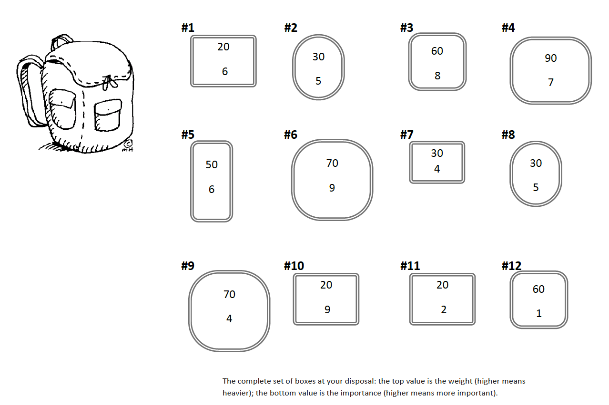

# Solving Knapsack Packing with Genetic Algorithms 
An approach to packing knapsacks with a genetic-algorithm driven approach

## Problem: 
You are going on a hiking trip, and there is a limit to the things you can bring. You have two things: a backpack with a size (the weight it can hold that is) and a set of boxes with different weights and different importance values. The goal is to fill the backpack to make it as valuable as possible without exceeding the maximum weight (250).
1. Define the problem as a genetic algorithm
2. Provide the genome for the problem
3. Define all the fringe operations
4. Cull your population by 50% at every generation

Below is the universe of boxes you are attempting to store in your backpack: 


## Setting Up The Code
This code was written using python version `3.7.5`, managed with `pyenv` and `pyenv-virtualenv`. Thankfully, however, this solution is lightweight/un-optimized enough to not need external packages, leveraging just the default modules supplied with python.

## Running The Code 
To run a genetic simulation, generating a solution to the problem, run: 
```bash
python run.py
```
While running, this simulation with log statistics to the console regularly to relay the current state of the population. 

## Toggling Experimental Parameters
`./config/config.ini` is a configuration file containing all relevant hyperparameters that control the way our population evolves over time. In particular: 
```
[APP] #Contains parameters that modulate the running of the simulation 
MAX_GENERATIONS: 2500 # A cap on the number of generations 
POPULATION_SIZE: 100 # The size of candidate solutions at any given iteration of our simulation
PRINT_FREQUENCY: 25 # Every PRINT_FREQUENCY generations, print a report of the current generation to the console

[LOGGER]
LOGGER_NAME: genetic_algorithm # Establish a common root logger for files to stem from

[INDIVIDUAL]
MUTATION_RATE: 0.2 # With every new offspring, this is the likelihood of a single point mutation in a gene 

[POPULATION]
CULL_RATE: 0.5 # What percentage of the population should be killed off every generation

[BOXES]
JSON_PATH: data/box-data.json # Path to the JSON file describing available boxes, relative to the directory the script is being run from 
WEIGHT_LIMIT: 250 # Cap on the maximum weight allowed in our knapsack 
```


## Additional Q&A's

### How does one define knapsack packing as a genetic algorithm's problem?

We can model our problem of knapsack packing as a genetic algorithm by creating an initial population of randomly selected solutions to the packing problem, defining a fitness function with which we can evaluate how optimal optimal a solution is, removing the bottom 50% of current solutions, and by generating novel solutions by "mating" the remaining population, creating new populations until we either a) meet some solution criteria, or b) have finished some cutoff number of `k` generations.

### What does the genome look like for this problem?
Defining the genetic representation for a problem like this, in addition to the fringe operation, is where some of the magic lies. But with many things in Computer Science, sometimes it's better ot just start simple and, once the scaffolding is complete and the straightforward solution is done, get creative afterwards. To begin, we can express our genome as an array of booleans. Each index `i` in the array corresponds to the `ith` object we're trying to pack in our sack; the boolean represents whether or not it's in the bag. While this representation may rub your intuitions the wrong way (won't this allow for invalid solutions in our population?) we can avoid choosing an invalid solution when we define our fitness function. 

### What do fringe operations look like in this ecosystem?
The fringe operations we need to define are our mutation function and a cross-over function. 

For our dead-simple genome: 
- Mutation: Flip some `k%` of randomly selected booleans in an individuals genome.
- Crossover: Generate a random crossover point on the gene; an offspring inherits from parent one `p1_genome[:crossover_point]` and parent two `p2_genome[crossover_point:]`. 

